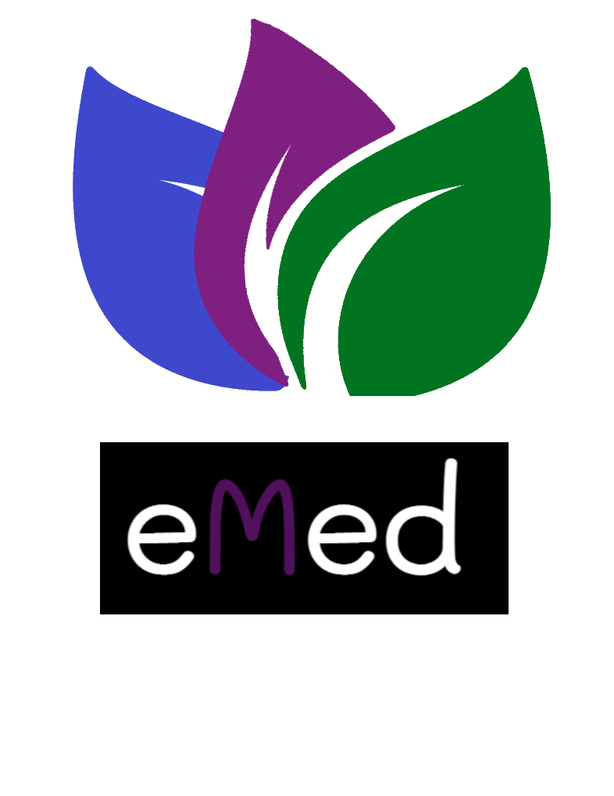
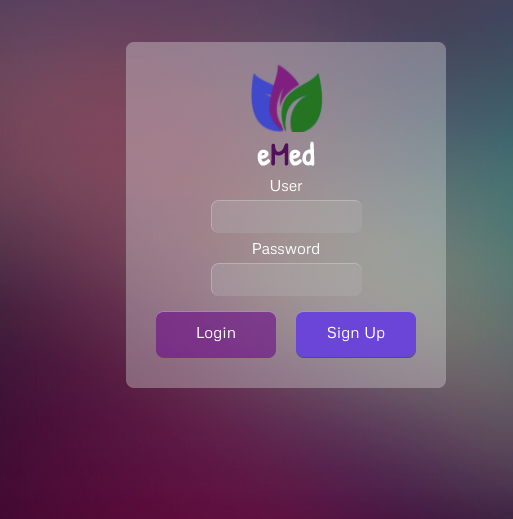
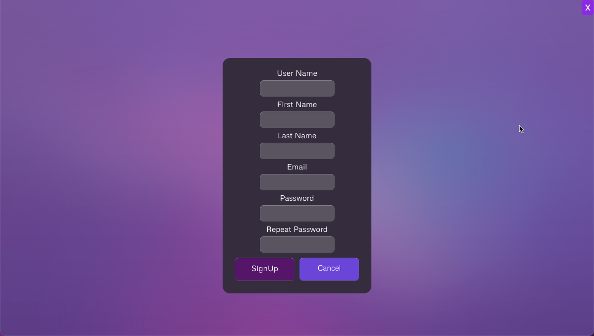
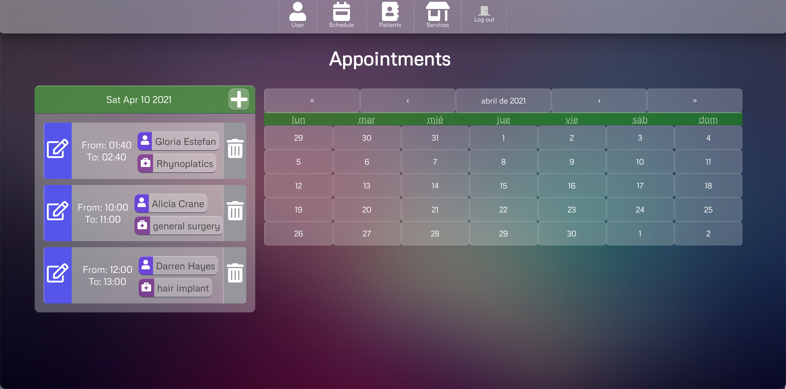
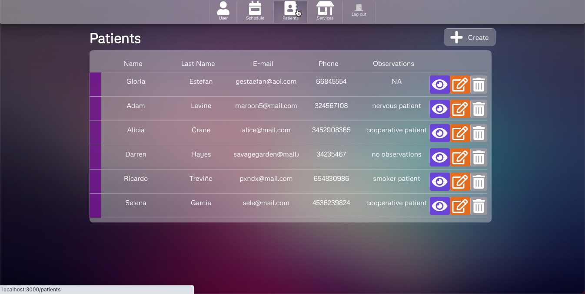
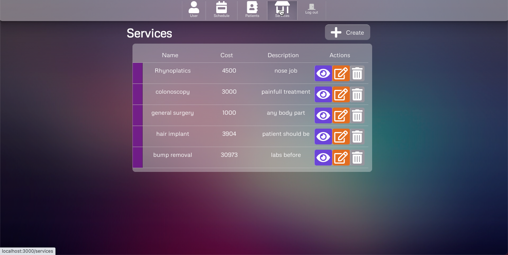
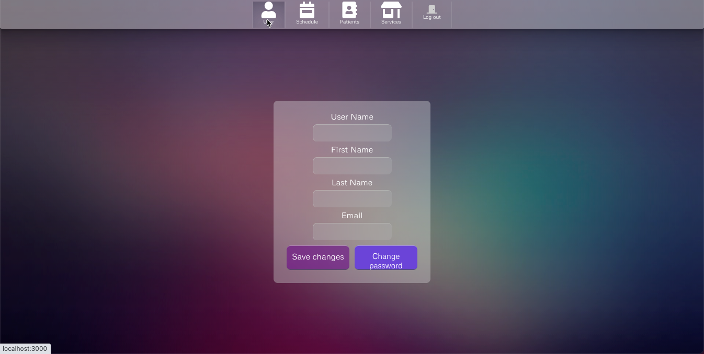

#  Medical Appointment Managing System

---

​

1. [Description and User's Story](#description-and-user's-story)
2. [Functionalities](#functionalities)
3. [List of Dependencies and Libraries](#list-of-dependencies-and-libraries)
4. [Installation](#installation)
5. [How to Set Profiles and Appointments](#how-to-set-user-profiles-and-appointments)
6. [Demo](#demo)
7. [Licenses](#licenses)
8. [Support and Contributions](#support-and-contributions)
9. [Future Development](#future-development)
10. [Credits and Acknowledgements](#credits-and-acknowledgements)
    ​

## ​

​

## Description and User's Story

​
`AS a Medical Specialty Clinic, WE NEED an appointment management system, that ALLOWS us to CREATE a doctor user that is able to CREATE, EDIT and DELETE new patient records and, SET appointments for different treatments in a calendar that belogns to each treating physician. `
​

​
**EMed** is a web application that can help medical specialists install a simple server-based appointment system for their clinics or private offices. The system allows for simple management of their patients' appointments and to track medical services and treatments through verified users.
​

## ​

​

## Functionalities

​
Currently, the system offers the following _features_:
​

- Users can create their own single user profile (first and last name, email, and password) and log in into the system, with his own user an password.
- Logged in users (email and password) can create a new patient profile and input their personal information and clinical history (such as first and last name, email, phone number, sex, age, current diseases; current medication, allergies, and general observations).
- After setting the profile of a patient, the user can create an appointment (date, start and end time of appointment, and patient's name) and set a service treatment for that patient.
- The calendar tool allows users to filter appointments by date.
- Users can also add service treatments in a separate section. They can add a new treatment by adding the information and costs of said service.
- The app allows create, editing, deliting information of patients, services, and appointments.
  ​

## ​

​

## List of Dependencies and Libraries

​
The application was designed and build by _Creat React App_, programmed through a combination of _JavaScript_ hosted on several _React_ _NPM_ libraries, _pure HTML_, _pure CSS_, and backed by _MongoDB_ _Mongoose, \_NoSQL_ Database that uses json-like documents. The application is fully functional and hosted in a _Heroku_ external server.
​

The Full-Stack breakdown of the application is as follows:
​

- [Create React App](https://create-react-app.dev/) is an app that help you builds the initials steps and structure to create a React app.
  ​
- [NodeJS](https://nodejs.org/en/) is one of the most widely used local server environments for JavaScript programming. NodeJS was used for local server-testing and to handle server and database connections.
  ​
- [Express](https://www.npmjs.com/package/express) is a NodeJS-based npm web framework library. It was integrated into JavaScript in order to handle HTTP requests from the database schemas.
  ​
- [MongoDB](https://www.mongodb.com/) and [Mongoose](https://www.npmjs.com/package/mongoose) are one of the most widely used database services in Full-Stack web development. We used MongoDB Atlas workbench to develop the database that serves as the basis for the management system and the automatic creation of tables and ID elements. it can handle several new dependencies
  ​
- [Axios](https://www.npmjs.com/package/axios) is a Javascript library used to make HTTP requests from node.js or XMLHttpRequests from the browser that also supports the ES6 Promise API.

- [Moment.js](https://momentjs.com/) is a JavaScript library which helps is parsing, validating, manipulating and displaying date/time in JavaScript in a very easy way
  ​
- [Passport](https://www.npmjs.com/package/passport) and [Passport-Local](https://www.npmjs.com/package/passport-local) are Express-based library tools to integrate user authentication into script frameworks. Passport handles authentication, while Passport-Local focuses on authenticating events using an email and a password. These two dependencies are the basis for the Login/SignUp features of this application.
  ​
- [Express-Session](https://www.npmjs.com/package/express-session) is an Express extension library used for parsing of cookies and URL parameters. This allows for hiding Back-End data from the Front-End, for example sensitive information, such as, user data and passwords. It sets an ID for a client in the database and manages requests from the server linked to this ID. This application uses Sessions as middleware step in the authentication process.
  ​
- [BcryptJS](https://www.npmjs.com/package/bcrypt) is an extension library that, when implemented, automatically hashes/encrypts passwords in a database. This application integrates Bcrypt in the authentication process and sends a hashed/encrypted password when a new user is registered to the database.
  ​
- [DatePicker](https://www.npmjs.com/package/js-datepicker) JavaScript DatePicker is a lightweight and mobile-friendly control that allows end users to enter or select a date value. It has month, year, and decade view options to quickly navigate to the desired date. It supports minimum dates, maximum dates, and disabled dates to restrict the date selection.

- [react-to-pdf](https://www.npmjs.com/package/react-to-pdf) is a basic npm tool to Easily create pdf documents from React components.

- [Heroku](https://dashboard.heroku.com/) is a container-based cloud Platform as a Service (PaaS). Developers use Heroku to deploy, manage, and scale modern apps. The Heroku experience provides services, tools, workflows, and polyglot support—all designed to enhance developer productivity.

- ​

## ​

​

## Installation

​
If you are interested in running **EMed** locally, you can follow these steps:
​

1. Clone or download the repo.
   ​
2. Using your terminal, navigate into the main repository, and run `npm install` in order to install all npm and React dependencies and libraries, you also have to run `npm install` on the client folder (you may also need to install MongoDB or change the database dialect of the schema file).
   ​
3. Open your preferred code editor, navigate into the configuration folder and add your local server credentials in the development object (username, password, and local host).
   ​
4. After everything is set, you can then run the application `server.js` using the _npm start_ comand in your terminal. After, navigate to your localhost connection on your preferred web browser.
   ​
   Or, alternatively, you can use the demo page we deployed on a [Heroku](https://ibmug-emed.herokuapp.com/) external server. You can access the functional app [here](https://github.com/jpineda30/Proyect-3).
   ​

## ​

​

## How to Set User Profiles and Appointments

​

Navigate to main page `localhost:[yourlocalhost]/` and click **Profile** on the left navigation bar.
​
The site will send you to the User creation page. Type your info and click the **Sign Up** button.

​If the user was created successfully, the page will then send you to the **Login** page. Input your credentials and click the **Login** button.
​

​After logging in, will be redirect to **Appointments** section; you can set an appointment in there, select a date choosing a particular date on the main calendar, then using the modal calendar tool to schedule an hour to start and end times, choose the patient and the treatment to be provided, click the **Save** button to set an appointment for that date.
You can also edit, or delete an appointment

You can create a patient by clicking **Patients** on the navigation bar.
​In the **Patients** page, you can add a new patient by clicking the **Create** button.
​Fill in the form all the patient's information and clinical history. Then, click the **Save** button.
You can always view, edit, or delete a patient using the buttons on the right side.

 
​
​

​

​The **Services** page has the same functionalities as the **Patients**/**Appointments** section.

you can go to the **user** page that let you manage and change your credentials

And if you wish you can Logout the app

## ​

​

## Demo

​
The following Gif provides a demonstration of **EMed's** functionalities:
​

​

## ​

​

## Licenses

​

​

​

​

​

## ​

​

## Support and Contributions

​
This project is not currently looking for contributors.
If you're experiencing any issues with the code, feel free to contact us through GitHub or raise an [issue](https://github.com/jpineda30/Proyect-3) in the original repository.
​

## ​

​

## Future Development

​
These are some improved functionalities we want to add to the project in the near future:
​
​

- Extend the database so users can access patients' documents (for example, interconsultations with an another specialist, lab results, reports or X-Ray charts).
  ​
- Create a payment and balance system for appointments showing patients' current or pending payments and total balance owed.
  ​
- Integrate medical inventory to services: costs of materials needed for treatments, alert status of available materials, and capacity to order/reorder more inventory.
  ​
- Integrate an email/calendar system for patients: send email remainders to patients about upcoming appointments and develop a connection to a calendar API that can help patients integrate their appointments to their schedules.

- A public web page link to the app for the patients can create their own appointments and is connected to the app database to check if there are dates available.
  ​
  ​

## ​

​

## Credits and Acknowledgements

​
This project was conceived, developed, and coded by:
​

- **José Pineda Esquer** [Github: jpineda30](https://github.com/jpineda30)
- **Rodrigo Sánchez** [Github: ibmug ](https://github.com/ibmug)
- **Alhelí Miranda Campos** [Github: AlheliMi](https://github.com/AlheliMi)
  ​

  We would like to give special thanks to our Full-Stack Web Development Bootcamp instructors, Diana (main instructor) and Fernanda (TA), for their invaluable help in the building process of the app
